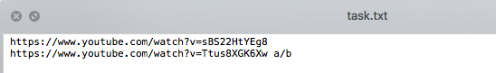

# ytb

This tool is based on [youtube-dl](https://github.com/ytdl-org/youtube-dl), to use it please make sure golang was installed & Youtube can be visited.


### how to use?

1, downloading ytb tool

```bash
go install github.com/scott-x/ytb
```

2, configuration

```bash
mkdir ~/.ytb
touc ~/.ytb/youtube-dl.json
```

`/youtube-dl.json` has 2 properties as shown below:

```json
{
	"to":"~/Desktop/%(title)s.%(ext)s",
	"task_position":"/Users/scottxiong/Desktop/task.txt"
}
```

- `to`: `to` indicates where these video will go to 
- `task_position`: before downloading, list the download youtube url line by line.


For Example:



```bash
$ go run main.go
set http/https proxy...
start downloading ===> https://www.youtube.com/watch?v=euf7BCpWZgA
start downloading ===> https://www.youtube.com/watch?v=BkPMZDgfH4M
start downloading ===> https://www.youtube.com/watch?v=qXlS-X0ddsA
https://www.youtube.com/watch?v=euf7BCpWZgA ===> 100% downloaded
2020/11/28 12:06:26 https://www.youtube.com/watch?v=euf7BCpWZgA is deleted from /Users/scottxiong/Desktop/task.txt
https://www.youtube.com/watch?v=qXlS-X0ddsA ===> 100% downloaded
2020/11/28 12:06:54 https://www.youtube.com/watch?v=qXlS-X0ddsA is deleted from /Users/scottxiong/Desktop/task.txt
https://www.youtube.com/watch?v=BkPMZDgfH4M ===> 100% downloaded
2020/11/28 12:12:31 https://www.youtube.com/watch?v=BkPMZDgfH4M is deleted from /Users/scottxiong/Desktop/task.txt
```
